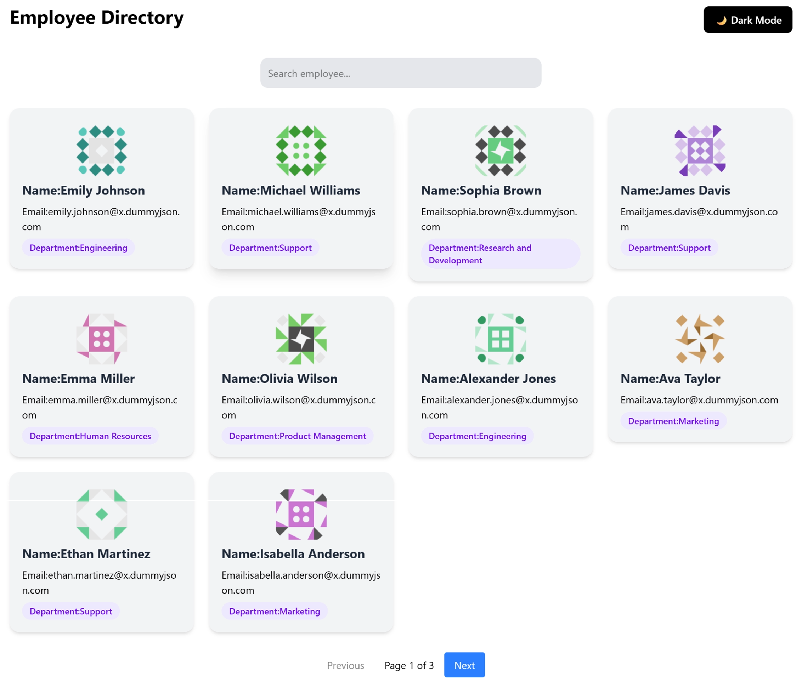
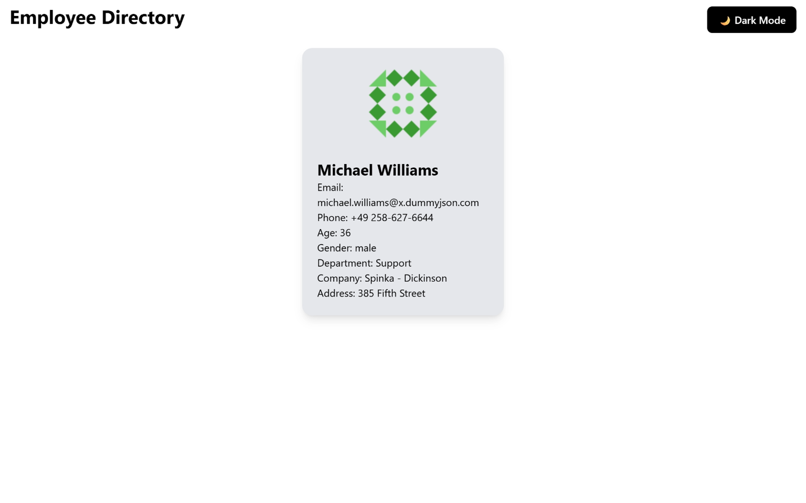
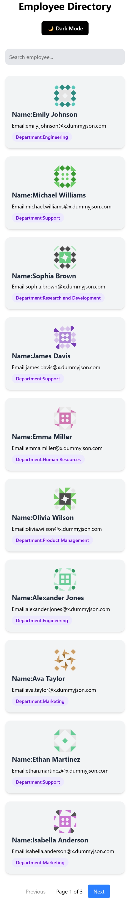
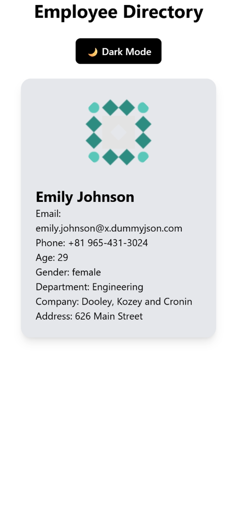

Employee Directory App

A modern, scalable React application that allows users to browse, search, and view detailed employee profiles. Built with a focus on clean architecture, reusable components, API integration, and responsive UI/UX design.

Features-
    Employee Listing

Fetches employee data from external API - https://dummyjson.com/users

Displays:
Full Name
Email Address
Department (company.department)
Profile Image
Real-time search by employee name
Handles loading and error states gracefully

Employee Details Page:
Click on any employee to view detailed profile
Displays complete employee information:
Name
Email
Phone
Address
Company details
Clean and user-friendly layout

Pagination for large datasets
Dark / Light mode toggle
Fully responsive design (mobile, desktop)
Reusable UI components.

Tech Stack :
React (Functional Components)
Vite (Fast build tool)
React Router DOM
Fetch API
React Hooks (useState, useEffect, custom hooks)
CSS / Tailwind CSS (based on implementation)

Folder Structure-

src/
├── components/
│   ├── EmployeeCard.jsx
│   ├── EmptyState.jsx
│   ├── ErrorState.jsx
│   ├── LoadingState.jsx
│   ├── Pagination.jsx
│   ├── SearchBar.jsx
│   └── ThemeToggle.jsx
│
├── hooks/
│   ├── theme.js
│   └── useEmployees.js
│
├── pages/
│   ├── EmployeeList.jsx
│   └── EmployeeDetails.jsx
│
├── services/
│   └── employeeServices.js
│
├── utils/
│   └── paginateEmployee.js
│
├── App.jsx
├── index.css
└── main.jsx 

setup Instructions -
1. Clone the repository:
git clone https://github.com/your-username/employee-directory.git

2. Navigate to project directory
cd employee-directory

3. Install dependencies
npm install

4. Start development server
npm run start

Assumptions
API returns consistent user structure
Each employee has a valid company object
No authentication required for API access

Future Improvements-
Add authentication (Login system)
Advanced filtering (department, location)
React Query for caching & state management
Unit testing (Jest + React Testing Library)
Dashboard analytics view
Backend integration (Node + MongoDB)

 Screenshots

 Desktop View

Mobile View

